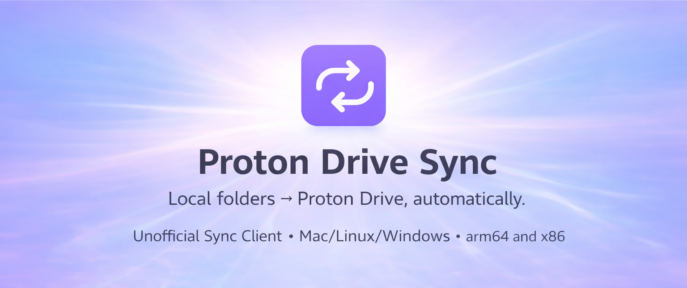

<p align="center">
  
</p>

<p align="center">
  <video src="https://github.com/user-attachments/assets/bf1fccac-9a08-4da1-bc0c-2c06d510fbf1"/>
</p>

<a href="https://www.buymeacoffee.com/thebitflipper" target="_blank">
  
</a>

## Installation

### macOS

```bash
brew tap DamianB-BitFlipper/tap
brew update
brew install proton-drive-sync

proton-drive-sync setup
```

### Linux

#### Debian / Ubuntu

```bash
# Add repository
echo "deb [trusted=yes] https://repo.damianb.dev/apt/ * *" | sudo tee /etc/apt/sources.list.d/proton-drive-sync.list
sudo apt update

# Install
sudo apt install proton-drive-sync

proton-drive-sync setup
```

#### Fedora / RHEL / CentOS

```bash
# Add repository
sudo tee /etc/yum.repos.d/proton-drive-sync.repo << 'EOF'
[proton-drive-sync]
name=Proton Drive Sync
baseurl=https://repo.damianb.dev/yum/
enabled=1
gpgcheck=0
EOF

# Install
sudo dnf install proton-drive-sync

proton-drive-sync setup
```

<details>
<summary>Homebrew (Linux)</summary>

```bash
brew tap DamianB-BitFlipper/tap
brew update
brew install proton-drive-sync

proton-drive-sync setup
```

</details>

<details>
<summary>Arch Linux (AUR)</summary>

Install from the [AUR package](https://aur.archlinux.org/packages/proton-drive-sync-bin):

```bash
# Install via yay
yay -S proton-drive-sync-bin

# Install via paru
paru -S proton-drive-sync-bin
```

</details>

<details>
<summary>AppImage</summary>

Download the AppImage from [GitHub Releases](https://github.com/DamianB-BitFlipper/proton-drive-sync/releases/latest):

```bash
# Download (replace VERSION and ARCH as needed)
wget https://github.com/DamianB-BitFlipper/proton-drive-sync/releases/latest/download/Proton_Drive_Sync-VERSION-x86_64.AppImage

# Make executable and run
chmod +x Proton_Drive_Sync-*.AppImage
./Proton_Drive_Sync-*.AppImage setup

# Optionally move to PATH
sudo mv Proton_Drive_Sync-*.AppImage /usr/local/bin/proton-drive-sync
```

</details>

<details>
<summary>Flatpak</summary>

Download the Flatpak bundle from [GitHub Releases](https://github.com/DamianB-BitFlipper/proton-drive-sync/releases/latest):

```bash
# Download (replace VERSION and ARCH as needed)
wget https://github.com/DamianB-BitFlipper/proton-drive-sync/releases/latest/download/Proton_Drive_Sync-VERSION-x86_64.flatpak

# Install
flatpak install --user Proton_Drive_Sync-*.flatpak

# Run
flatpak run io.github.damianbbitflipper.ProtonDriveSync setup
```

</details>

<details>
<summary>Tarball (manual)</summary>

Download the Linux tarball from [GitHub Releases](https://github.com/DamianB-BitFlipper/proton-drive-sync/releases/latest):

```bash
tar -xzf proton-drive-sync-linux-x64.tar.gz
sudo mv proton-drive-sync /usr/local/bin/
proton-drive-sync setup
```

</details>

### Coming Soon

<details>
<summary>Windows</summary>

Download the `.zip` from [GitHub Releases](https://github.com/DamianB-BitFlipper/proton-drive-sync/releases/latest), extract, and add to your PATH.

</details>

<details>
<summary>Docker</summary>

See **[DOCKER_SETUP.md](DOCKER_SETUP.md)** for running with Docker Compose on Linux x86_64 and ARM64.

```bash
cd docker/
cp .env.example .env
# Edit .env with KEYRING_PASSWORD and sync directory paths
docker compose up -d
docker exec -it proton-drive-sync proton-drive-sync auth
```

</details>

### Installing Pre-release Versions

<details>
<summary>Pre-release packages</summary>

Pre-release packages (`proton-drive-sync-prerelease`) allow you to test upcoming features before stable release. They conflict with the stable package, so only one can be installed at a time.

#### macOS

```bash
brew tap DamianB-BitFlipper/tap
brew install proton-drive-sync-prerelease
```

#### Debian / Ubuntu

```bash
# Add repository (if not already added)
echo "deb [trusted=yes] https://repo.damianb.dev/apt/ * *" | sudo tee /etc/apt/sources.list.d/proton-drive-sync.list
sudo apt update

# Install prerelease
sudo apt install proton-drive-sync-prerelease
```

#### Fedora / RHEL / CentOS

```bash
# Add repository (if not already added)
sudo tee /etc/yum.repos.d/proton-drive-sync.repo << 'EOF'
[proton-drive-sync]
name=Proton Drive Sync
baseurl=https://repo.damianb.dev/yum/
enabled=1
gpgcheck=0
EOF

# Install prerelease
sudo dnf install proton-drive-sync-prerelease
```

#### Arch Linux (AUR)

On Arch Linux and derivatives, install from the [AUR package](https://aur.archlinux.org/packages/proton-drive-sync-prerelease-bin):

```bash
# Install via yay
yay -S proton-drive-sync-prerelease-bin

# Install via paru
paru -S proton-drive-sync-prerelease-bin
```

#### Manual Installation

Download the pre-release tarball for your platform from [GitHub Releases](https://github.com/DamianB-BitFlipper/proton-drive-sync/releases) and extract it:

```bash
# Example for macOS arm64
tar -xzf proton-drive-sync-darwin-arm64.tar.gz
sudo mv proton-drive-sync /usr/local/bin/
```

#### Switching Between Stable and Pre-release

The packages conflict with each other, so installing one will automatically remove the other:

```bash
# Switch to prerelease
sudo apt install proton-drive-sync-prerelease

# Switch back to stable
sudo apt install proton-drive-sync
```

</details>

## Usage

### Dashboard

The dashboard runs locally at http://localhost:4242. Use it to configure and manage the sync client.

### Commands

| Command                    | Description                                          |
| -------------------------- | ---------------------------------------------------- |
| `proton-drive-sync setup`  | Interactive setup wizard (recommended for first run) |
| `proton-drive-sync auth`   | Authenticate with Proton                             |
| `proton-drive-sync start`  | Start the sync daemon                                |
| `proton-drive-sync stop`   | Stop the sync daemon                                 |
| `proton-drive-sync status` | Show sync status                                     |
| `proton-drive-sync --help` | Show all available commands                          |

### Uninstall

To completely remove proton-drive-sync and all its data:

```bash
proton-drive-sync reset --purge
```

This will stop the service, remove credentials, and delete all configuration and sync history.

For package managers:

- **Homebrew**: `brew uninstall proton-drive-sync`
- **Debian/Ubuntu**: `sudo apt remove proton-drive-sync`
- **Fedora/RHEL**: `sudo dnf remove proton-drive-sync`

## Development

See [DEVELOPMENT.md](DEVELOPMENT.md) for development setup and contributing guidelines.
