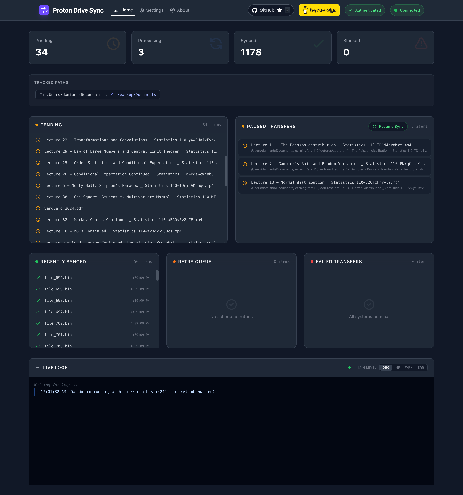

# Proton Drive Sync

Automatically syncs selected local folders to Proton Drive in the background, with a dashboard for monitoring.

<p align="center">
  
</p>

## Getting Started

### Quick Start

Installs `proton-drive-sync` and walks you through authentication and setup:

```bash
curl -fsSL https://www.damianb.dev/proton-drive-sync/install.sh | bash
```

### Requirements

- macOS (Linux/Windows not yet supported — [open an issue](https://github.com/damianb-bitflipper/proton-drive-sync/issues) to register interest)
- [Homebrew](https://brew.sh)

### Dashboard

The dashboard runs locally at http://localhost:4242. Use it to configure and manage the sync client.

### Supplementary Commands

1. If you need to reauthenticate: `proton-drive-sync auth`

2. If you would like to start the sync client (as a daemon): `proton-drive-sync start`

3. If you would like to stop the sync client: `proton-drive-sync stop`

4. For more advanced commands, see: `proton-drive-sync --help`

## Development

See [DEVELOPMENT.md](DEVELOPMENT.md) for development setup and contributing guidelines.
